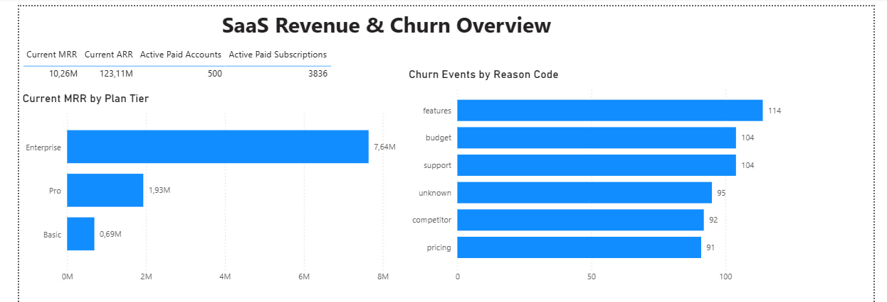
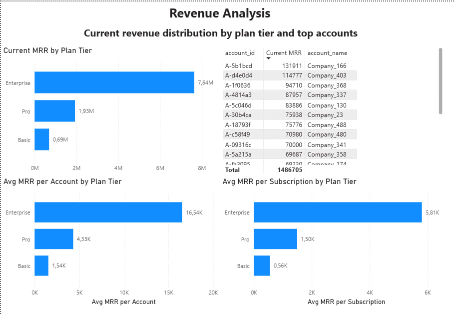
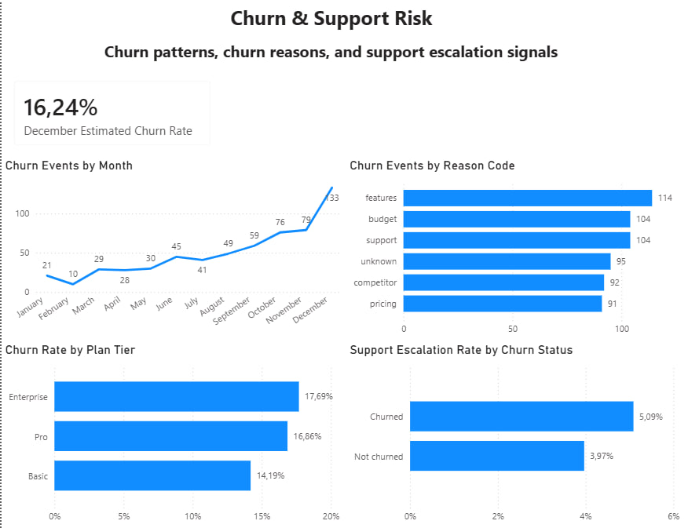

# SaaS Churn & Revenue Analysis

## Project Overview

This project analyzes a fictional SaaS company with subscription-based revenue.

The goal is to understand:

- how current recurring revenue is distributed;
- which plan tiers generate the most MRR;
- how churn develops over time;
- which churn reasons appear most often;
- whether support escalation is connected with churn risk.

The project follows a SQL-first analytics workflow:

```text
business problem → dataset → data quality → SQL analysis → Python EDA → Power BI dashboard → insights → recommendations
```

---

## Business Problem

A SaaS company wants to understand why customers cancel their subscriptions, which plans generate the most revenue, and what actions can improve retention and protect MRR.

The main business questions are:

1. How much current MRR and ARR does the company have?
2. Which plan tiers contribute the most to current recurring revenue?
3. Which plan tiers have the highest average revenue per account and subscription?
4. How does churn change over time?
5. What are the most common churn reasons?
6. Which plan tiers show the highest estimated churn rate?
7. Are support escalations higher among churned accounts?
8. Is current revenue concentrated in a few large accounts?

---

## Dataset

The project uses a synthetic multi-table SaaS dataset.

Dataset source details are documented in:

```text
docs/dataset_source.md
```

The dataset includes account, subscription, churn, support, and product usage data.

Main tables used in the project:

| Table | Description |
|---|---|
| `accounts` | Customer/account-level information |
| `subscriptions` | Subscription, plan tier, MRR, ARR, trial and churn fields |
| `churn_events` | Churn events, churn dates, reasons, refunds and reactivation flags |
| `support_tickets` | Support activity, escalation, response time and satisfaction data |
| `feature_usage` | Product feature usage data |

---

## Tools Used

| Tool | Purpose |
|---|---|
| PostgreSQL / SQL | Main business analysis, joins, aggregations, revenue and churn metrics |
| Python / pandas | Data understanding, data quality checks, lightweight visual EDA |
| Power BI | Dashboard creation and business presentation |
| GitHub | Project documentation and portfolio packaging |

---

## Repository Structure

```text
saas-churn-revenue-analysis/
├── data/
│   ├── raw/
│   └── processed/
├── dashboard/
│   └── screenshots/
├── docs/
│   ├── business_questions.md
│   ├── dashboard_plan.md
│   ├── data_dictionary.md
│   ├── dataset_source.md
│   └── insights.md
├── notebooks/
│   └── 01_data_cleaning_eda.ipynb
├── sql/
│   ├── 01_create_tables.sql
│   ├── 02_import_data.sql
│   ├── 03_data_quality_checks.sql
│   └── 04_business_analysis.sql
└── README.md
```

---

## Workflow

### 1. Data Understanding

The raw dataset was reviewed to understand:

- available tables;
- column meanings;
- relationships between tables;
- table grain;
- possible business use cases.

A data dictionary was created in:

```text
docs/data_dictionary.md
```

---

### 2. Data Quality Checks

Data quality was checked using Python and SQL.

Main checks included:

- missing values;
- duplicate rows;
- primary key uniqueness;
- foreign key consistency;
- date logic;
- numeric value validity;
- trial subscriptions with zero revenue;
- support satisfaction score validity.

Key data quality findings:

- Full duplicate rows were not found.
- Primary keys were valid for most tables.
- `feature_usage.usage_id` had duplicate values, so a technical key `feature_usage_id` was added.
- `subscriptions.end_date` has many missing values, which is expected for active subscriptions.
- `support_tickets.satisfaction_score` has missing values where no rating was provided.
- `churn_events.feedback_text` has missing values where no written feedback was provided.
- `feature_usage.usage_date` has lifecycle inconsistencies, so it was not used for lifecycle or cohort analysis.

The SQL data quality script is available in:

```text
sql/03_data_quality_checks.sql
```

---

### 3. SQL Business Analysis

The main business analysis was completed in SQL.

The final SQL analysis file is:

```text
sql/04_business_analysis.sql
```

The SQL analysis covers:

- monthly recurring revenue trend;
- current MRR and ARR snapshot;
- current revenue by plan tier;
- average revenue per account and subscription;
- monthly churn events;
- churn by reason code;
- churn by plan tier;
- estimated monthly churn rate;
- churn rate by plan tier;
- support tickets and churn;
- feature usage summary;
- revenue concentration among top accounts.

---

### 4. Python EDA

Python was used as a supporting tool, not as the main analysis layer.

The notebook is available in:

```text
notebooks/01_data_cleaning_eda.ipynb
```

Python was used for:

- loading and checking cleaned CSV files;
- validating row counts;
- basic data quality checks;
- simple visual summaries.

Python visual summary charts include:

- current MRR by plan tier;
- churn events by reason code;
- support escalation rate by churn status.

---

### 5. Power BI Dashboard

A Power BI dashboard was created to present the main business findings visually.

The dashboard has 3 pages:

| Page | Purpose |
|---|---|
| Executive Overview | High-level business performance summary |
| Revenue Analysis | Revenue distribution by plan tier and top accounts |
| Churn & Support Risk | Churn patterns, churn reasons, and support risk signals |

The dashboard plan is documented in:

```text
docs/dashboard_plan.md
```

---

## Dashboard Preview

### Page 1 — Executive Overview

This page gives a high-level view of current recurring revenue, active paid accounts, active subscriptions, revenue by plan tier, and churn reasons.



---

### Page 2 — Revenue Analysis

This page explains where current MRR comes from and highlights the most important revenue segments and top accounts.



---

### Page 3 — Churn & Support Risk

This page focuses on churn trends, churn reasons, churn rate by plan tier, and support escalation signals.



---

## Key Findings

### 1. Current recurring revenue is strong

As of the latest reporting date, the business has:

| Metric | Value |
|---|---:|
| Current MRR | 10.26M |
| Current ARR | 123.11M |
| Active paid accounts | 500 |
| Active paid subscriptions | 3,836 |

This means the company has a large active paid subscription base in the current reporting period.

---

### 2. Enterprise is the main revenue driver

Enterprise contributes the largest share of current MRR.

| Plan tier | Current MRR | MRR share |
|---|---:|---:|
| Enterprise | 7.64M | 74.46% |
| Pro | 1.93M | 18.81% |
| Basic | 0.69M | 6.72% |

Enterprise is the key revenue segment and should be prioritized in retention and account management.

---

### 3. Enterprise has the highest revenue efficiency

Enterprise also has the highest average MRR per account and per subscription.

| Plan tier | Avg MRR per account | Avg MRR per subscription |
|---|---:|---:|
| Enterprise | 16.54K | 5.81K |
| Pro | 4.33K | 1.50K |
| Basic | 1.54K | 0.56K |

This shows that Enterprise customers are more valuable on average than Pro and Basic customers.

---

### 4. Churn increases toward the end of the period

Churn events increase over time and reach the highest point in December.

December shows:

| Metric | Value |
|---|---:|
| Churn events | 117 |
| Churned accounts | 96 |
| Estimated monthly churn rate | 16.24% |

This suggests that churn should be monitored closely, especially in the later reporting months.

---

### 5. Feature-related churn is the top reported churn reason

The most common churn reason is `features`.

| Reason code | Churn events | Share |
|---|---:|---:|
| features | 114 | 19.00% |
| budget | 104 | 17.33% |
| support | 104 | 17.33% |
| unknown | 95 | 15.83% |
| competitor | 92 | 15.33% |
| pricing | 91 | 15.17% |

However, churn reasons are relatively balanced. Churn is not explained by one single issue only.

---

### 6. Enterprise has the highest estimated churn rate

In the latest reporting month, estimated churn rate by plan tier is:

| Plan tier | Estimated churn rate |
|---|---:|
| Enterprise | 17.69% |
| Pro | 16.86% |
| Basic | 14.19% |

Enterprise has the highest estimated churn rate, but the difference between plan tiers is not extremely large.

---

### 7. Churned accounts have a slightly higher support escalation rate

Support escalation rate is higher among churned accounts.

| Churn status | Support escalation rate |
|---|---:|
| Churned | 5.09% |
| Not churned | 3.97% |

This may indicate a weak support-related churn signal.

Important limitation:

```text
This shows association, not causation.
```

It does not prove that support escalations caused churn.

---

### 8. Revenue concentration is relatively low

The largest account contributes only about 1.29% of current MRR.

The top 20 accounts contribute about 14.49% of current MRR.

This means current recurring revenue is not extremely dependent on a small number of large accounts.

---

## Recommendations

### 1. Prioritize Enterprise retention

Enterprise is the main revenue driver and has the highest estimated churn rate.

Recommended actions:

- monitor Enterprise churn more closely;
- review Enterprise customer feedback;
- prioritize Enterprise account health checks;
- investigate feature gaps for Enterprise customers.

---

### 2. Investigate feature-related churn

`features` is the most common reported churn reason.

Recommended actions:

- review feature-related feedback;
- identify missing or weak product capabilities;
- compare feature complaints across plan tiers;
- prioritize product improvements that affect high-value customers.

---

### 3. Monitor churn spikes by month

Churn increases toward the end of the reporting period.

Recommended actions:

- track monthly churn events;
- compare churn reasons by month;
- investigate whether December churn is seasonal, product-related, or support-related;
- create recurring churn monitoring.

---

### 4. Watch support escalation as a churn risk signal

Churned accounts have a slightly higher support escalation rate.

Recommended actions:

- monitor accounts with escalated support tickets;
- review support cases for high-value customers;
- combine escalation tracking with account health monitoring.

---

### 5. Keep revenue concentration healthy

Revenue is not heavily concentrated in only a few accounts.

Recommended actions:

- continue monitoring top account dependency;
- protect high-value accounts;
- grow mid-sized accounts to keep revenue diversified.

---

## Important Limitations

- The dataset is synthetic, so patterns may be smoother than in real business data.
- MRR and ARR are based on active paid subscriptions.
- Trial subscriptions are excluded from revenue metrics.
- Churn rate is an estimate, not a production-grade revenue churn calculation.
- Revenue churn was not calculated.
- Support escalation analysis shows association, not causation.
- `feature_usage.usage_date` has lifecycle inconsistencies and was not used for cohort, lifecycle, or time-to-first-usage analysis.

---

## Project Status

| Stage | Status |
|---|---:|
| Case setup | Complete |
| Data understanding | Complete |
| Data quality checks | Complete |
| PostgreSQL setup | Complete |
| SQL business analysis | Complete |
| Python EDA | Complete |
| Power BI dashboard | Complete |
| GitHub packaging | In progress |
| Final QA | Pending |

---

## Main Files

| File | Purpose |
|---|---|
| `docs/business_questions.md` | Business questions for the analysis |
| `docs/data_dictionary.md` | Table and column documentation |
| `docs/dataset_source.md` | Dataset source information |
| `docs/dashboard_plan.md` | Planned Power BI dashboard structure |
| `docs/insights.md` | Final SQL-based insights and recommendations |
| `sql/01_create_tables.sql` | PostgreSQL table creation script |
| `sql/02_import_data.sql` | Data import documentation |
| `sql/03_data_quality_checks.sql` | SQL data quality checks |
| `sql/04_business_analysis.sql` | Main SQL business analysis |
| `notebooks/01_data_cleaning_eda.ipynb` | Python data checks and lightweight EDA |
| `dashboard/screenshots/` | Power BI dashboard screenshots |

---

## Final Summary

This project demonstrates a complete beginner-friendly but realistic Data Analyst workflow:

```text
dataset understanding
→ data quality checks
→ SQL database setup
→ SQL business analysis
→ Python visual EDA
→ Power BI dashboard
→ business insights
→ recommendations
→ GitHub portfolio packaging
```

The main business conclusion is:

> Enterprise is the key revenue segment, but it also requires close churn monitoring. Feature-related churn is the top reported churn reason, and support escalations may be a weak churn risk signal.
